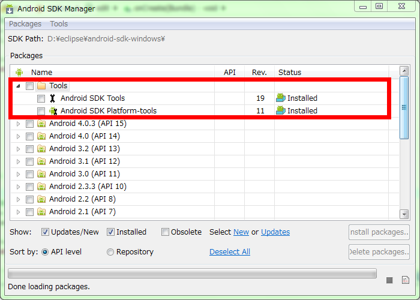
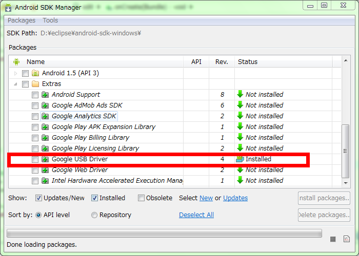
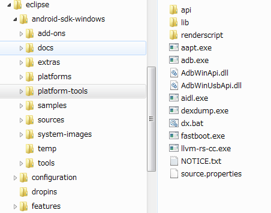
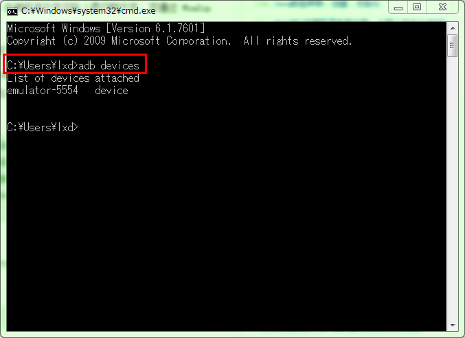
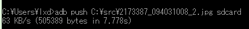

#Android开发调试工具ADB的使用
ADB（Android Debug Bridge）是Android SDK中的一个工具, 使用ADB可以直接操作管理Android模拟器或者真实的Andriod设备。  
    
ADB主要功能有:
	
	1、在Android设备上运行Shell(命令行)  
	2、管理模拟器或设备的端口映射  
	3、在计算机和设备之间上传/下载文件  
	4、将电脑上的本地APK软件安装至Android模拟器或设备上   

1、在使用ADB之前首先看看你的Eclipse中是否已经安装了Android SDK工具包（android插件的下载、安装请参照这里：Android程序开发的环境配置），如下图：  
   

这个USB 驱动也是需要的，用来连接你的Android设备。    
  

ADB是一个客户端-服务器端程序, 其中客户端是你用来操作的电脑, 服务器端是android设备。  

2、如果你已经安装了Android SDK 那么你可以在你的SDK目录下找到 ..\android-sdk-windows\platform-tools 这个目录，ADB工具就放在这里。如图：  
  

复制这个目录的路径，我们需要在windows的系统设置中将这个路径设置到PATH中，设置完成后我们就可以再CMD窗口中使用ADB了。

3、我们现启动，我们的andriod虚拟机，然后进入CMD窗口。  
  

这里的emulator-5554就是我的虚拟机设备   

4、常用的ADB命令

    a) adb install <apk文件路径>

      这个命令将指定的apk文件安装到设备上
 

    b) adb uninstall <软件名>
        adb uninstall -k <软件名>

        如果加 -k 参数,为卸载软件但是保留配置和缓存文件.
 

    c)adb shell 

       这个命令将登录设备的shell
       adb shell <command命令>

      后面加<command命令>将是直接运行设备命令, 相当于执行远程命令
 

    d)adb help

      这个命令将显示帮助信息
 

    e)adb push <本地路径> <远程路径>
       从电脑上发送文件到设备

       adb remount 在执行push命令之前我们还需要使用remount命令获取上传文件权限，否则会出现

       Read-only file system 的错误提示信息     

      示例如下图
  

     这里要注意的就是如果你需要向一个二级目录里放文件的时候， 一定使用"/"而不能使用"\"，
	原因是android是liunx下的系统，而我们用的是windows。比如：sdcard/aa这样就好啦，否则会提示找不到或者权限不够。

 

    f)adb get-product
       获取设备的ID

 

    g)adb get-serialno  
       获取设备的序列号

    h)adb devices  
      获取当前运行的模拟器/设备的实例的列表及每个实例的状态

    i) adb bugreport
        查看bug报告

5、常用的ADB Shell命令

    通过adb shell命令进入shell

        a)访问数据库
            sqlite3

        b)记录无线通讯日志
            一般来说，无线通讯的日志非常多，在运行时没必要去记录，但我们还是可以通过命令，设置记录：
            logcat -b radio

        c)删除应用
            Android没有提供一个卸载应用的命令，需要自己手动删除：
            cd /data/app
            rm 应用名称.apk

        d)查看目录
            ls

        e)打印或设置当前系统时间
            date

        f)查看内存信息
            cat /proc/meminfo

        g)查看CPU信息
            cat /proc/cpuinfo

 

6、删除Android系统Rom自带的软件

        a.确定手机root了,取得了root权限才能删除系统文件呀.
        b.下载Android_db.rar,解压到%windir/%System32下.
        c.手机连接数据线,在电脑上打开cmd,然后输入命令
                adb remount
                adb shell
                su
                执行完成之后,你会看到:
                * daemon not running. starting it now *
                * daemon started successfully *
        d.接着就是Linux命令行模式了,输入
                cd system/app
                你会发现没啥变化,然后输入ls回车.
                这时候列表显示了system/app里面的所有文件,也就是Rom集成的一些软件了.
        e.开始删除吧！比如删除Youtube,他的文件名是Youtube.odex和Youtube.apk
                我们要删除这2个文件,敲入以下命令:
                rm Youtube.*
                重启,Youtube已经删除掉了,注意各位同学千万不要删除你不知道是啥的东西.

 

7、sqlite3 adb命令

进入数据库的两种方式

    第一种：sqlite3 数据库名称.xx
  	第二种：adb shell
            sqlite3

	.databases               列出数据库文件名
	.tables ? PATTERN ?      列出 ? PATTERN ? 匹配的表名
	.import FILE TABLE       将文件中的数据导入的文件中
	.dump ? TABL E?          生成形成数据库表的SQL脚本
	.output FILENAME         将输出导入到指定的文件中
	.output stdout           将输出打印到屏幕
	.mode MODE ? TABLE ?     设置数据输出模式(csv,html,tcl…
	.nullvalue STRING        用指定的串代替输出的NULL串
	.read FILENAME           执行指定文件中的SQL语句
	.schema  ?TABLE ?        打印创建数据库表的SQL语句
	.separator STRING        用指定的字符串代替字段分隔符
	.show                    打印所有SQLite环境变量的设置
	.quit                    退出命令行接口

9/16/2015 9:31:41 AM 
by inmyfree